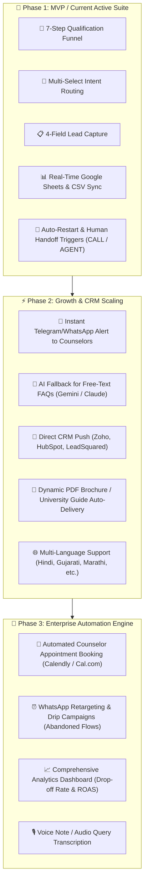
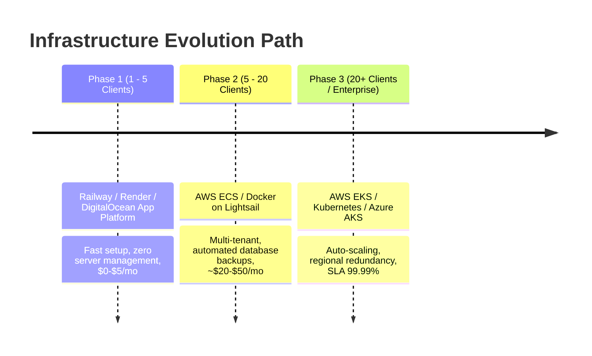

# 🌟 WhatsApp Automation Suite: Service Map & Pitch Deck

---

## 🗺️ 1. Architecture & Service Map (Current vs. Roadmap)

---

## 💼 2. Service Packages & Feature Matrix (Ready to Pitch)

Use this 3-tier structure when presenting proposals to consultancies:

| Feature / Capability | 🥉 Starter Funnel | 🥈 Pro Growth (Most Popular) | 🥇 Enterprise Dominance |
| :--- | :---: | :---: | :---: |
| **Full Qualification Flow (7+ Qs)** | ✅ | ✅ | ✅ |
| **Instant Lead Capture (Name, Email, City)** | ✅ | ✅ | ✅ |
| **Real-time Google Sheet Sync** | ✅ | ✅ | ✅ |
| **24/7 Cloud Uptime (Zero downtime)** | ✅ | ✅ | ✅ |
| **Instant Staff Alert (Telegram / SMS)** | ❌ | ✅ | ✅ |
| **AI FAQ Solver (Answers custom Qs)** | ❌ | ✅ | ✅ |
| **Automated PDF Guide Delivery** | ❌ | ✅ | ✅ |
| **Direct CRM Webhook (Zoho / HubSpot)** | ❌ | ❌ | ✅ |
| **Automated Meeting / Calendly Booking** | ❌ | ❌ | ✅ |
| **Drip Retargeting for Unfinished Leads** | ❌ | ❌ | ✅ |
| **Setup Fee** | **₹18,000 – ₹25,000** | **₹35,000 – ₹45,000** | **₹65,000 – ₹90,000** |
| **Monthly AMC (Maintenance & Support)** | **₹3,000 / mo** | **₹5,000 / mo** | **₹10,000 / mo** |

---

## 🎯 3. How to Pitch These Features to the Business (Client Benefits)

When talking to the owner or marketing head of a consultancy, emphasize **ROI and Speed to Lead**:

### 1. ⚡ "Instant 1-Second Response Time (Zero Lead Decay)"
* **The Problem:** 60% of students browse study abroad programs at night (9 PM – 2 AM). When they fill a website form, they wait 12–24 hours for a callback, by which time they have already contacted 3 competitor agencies.
* **The Pitch:** *"Your bot answers within 1 second at 1:00 AM, engages them in an interactive chat, and locks in their qualification before your competitor even sees their lead notification."*

### 2. 🎯 "Pre-Qualified Leads (Saves 70% Counselor Time)"
* **The Problem:** Counselors spend 4–6 hours a day calling leads who have zero budget or are just looking around.
* **The Pitch:** *"Your team only calls students whose country, intake, exam status, and budget are already verified and neatly formatted in your spreadsheet."*

### 3. 🔔 "Instant Hot-Lead Notification to Counselors" *(Upcoming Feature)*
* **The Benefit:** As soon as a student selects budget "₹40 Lakhs+" or "Master's in USA", the bot pings the Senior Counselor on WhatsApp/Telegram with a direct link to call the student immediately.

### 4. 📄 "Instant University Guide Delivery" *(Upcoming Feature)*
* **The Benefit:** If a student selects UK, the bot instantly sends an official "Alley Overseas UK Guide 2027.pdf" right in the chat. This builds immediate trust and authority.

### 5. ⏰ "Abandoned Cart / Re-engagement Drip" *(Upcoming Feature)*
* **The Benefit:** If a student drops off after Question 4, the bot gently pings them 2 hours later: *"Hey! You were just 2 questions away from discovering your scholarship eligibility. Want to continue?"* (Recovers 20–30% lost leads).

---

## ☁️ 4. Cloud Infrastructure Comparison: Railway vs AWS vs Azure vs K8s

As you scale from 1 client to 50+ clients, here is the technical infrastructure strategy:

| Cloud Platform | Setup Complexity | Monthly Cost (1–5 Clients) | Maintenance Overhead | Best For |
| :--- | :--- | :--- | :--- | :--- |
| **Railway** | 🟢 Minimal (5 mins, Git push) | **$0 – $5 / mo** | Zero (fully managed) | **Starting out & validating clients fast** |
| **AWS (App Runner / ECS / Lightsail)** | 🟡 Medium (Docker container) | **$10 – $25 / mo** | Low | **Production standard with custom domains** |
| **Azure (App Services)** | 🟡 Medium | **$15 – $30 / mo** | Low | **Corporate/Enterprise clients demanding Microsoft ecosystem** |
| **Kubernetes (AWS EKS / Azure AKS)** | 🔴 High (Helm, Ingress, Pods) | **$70 – $150+ / mo** | High (DevOps required) | **High scale (50,000+ chats/minute, 50+ enterprise tenants)** |

### 💡 Recommendation:
1. **Right Now:** Deploy on **Railway** (or **Render** / **DigitalOcean App Platform**). It builds directly from your GitHub repo in 30 seconds.
2. **Next Level (When you have 5+ paying clients):** Package as a single **Docker container** and deploy on **AWS App Runner** or **AWS Lightsail Container** with custom domains (`bot.yourdomain.com`).
3. **Enterprise Level:** Use **Kubernetes (K8s)** only if you build a multi-tenant SaaS dashboard managing hundreds of agencies simultaneously.
